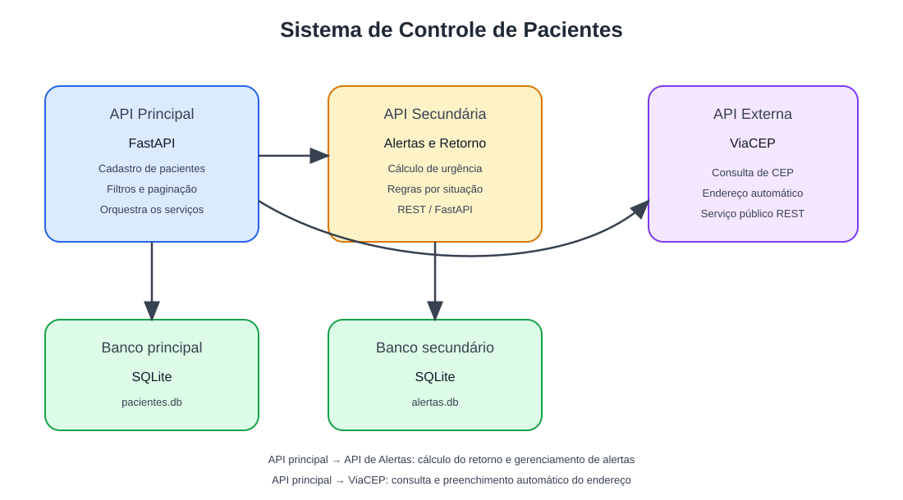

# Sistema de Controle de Pacientes

API principal para o gerenciamento de pacientes com cadastro, busca, filtros avançados, paginação, ordenação dinâmica e integração com a API pública do ViaCEP para preenchimento automático de endereço a partir do CEP.

## Objetivo

O sistema ajuda clínicas, consultórios e unidades de atendimento a organizar e consultar pacientes de forma prática, com regras de busca e filtros por nome, e-mail e endereço, além de manter histórico de visitas e situação clínica.

## Arquitetura

A aplicação segue o cenário 2 do MVP: a API principal consulta a API externa do ViaCEP para obter dados do endereço e persiste os registros no SQLite.



## Tecnologias

- Python
- FastAPI
- SQLAlchemy
- SQLite
- Pydantic
- Requests

## API externa utilizada

- ViaCEP
- URL base: https://viacep.com.br/ws/{cep}/json/
- Licença: uso livre para consulta pública, conforme documentação do serviço.
- Cadastro: não exige cadastro para uso básico.
- Rota utilizada: GET para consulta de um CEP específico.

## Requisitos

- Python 3.12+
- Pip
- Docker (opcional, para execução em container)

## Instalação local

1. Clone o repositório:
   ```bash
   git clone <url-do-repositorio>
   cd controle_pacientes
   ```
2. Crie um ambiente virtual:
   ```bash
   python3 -m venv venv
   source venv/bin/activate
   ```
3. Instale as dependências:
   ```bash
   pip install -r requirements.txt
   ```
4. Inicie a API:
   ```bash
   uvicorn main:app --host 0.0.0.0 --port 8000 --reload
   ```
5. Acesse a documentação Swagger:
   - http://localhost:8001/docs
   - http://localhost:8001/redoc

## Endpoints principais

### GET /pacientes
Lista pacientes com filtros, paginação e ordenação.

Parâmetros:
- nome
- email
- endereco
- situacao
- page
- page_size
- order_by: nome ou ultima_visita
- order_direction: asc ou desc

### POST /pacientes
Cria um novo paciente com preenchimento automático do endereço via ViaCEP.

### GET /pacientes/{paciente_id}
Busca um paciente por ID.

### PUT /pacientes/{paciente_id}
Atualiza os dados do paciente.

### DELETE /pacientes/{paciente_id}
Remove um paciente.

## Persistência

O banco de dados SQLite é armazenado no arquivo:

```bash
pacientes.db
```

## Executando com Docker

1. Construa a imagem:
   ```bash
   docker build -t controle_pacientes .
   ```
2. Execute o container:
   ```bash
   docker run -p 8000:8000 controle_pacientes
   ```

## Observações

- O nome dos arquivos e variáveis segue a convenção snake_case.
- As classes e schemas Pydantic seguem a convenção CamelCase.
- A API principal foi projetada para atender ao requisito mínimo de CRUD e também oferecer filtros, paginação e ordenação dinâmica.
